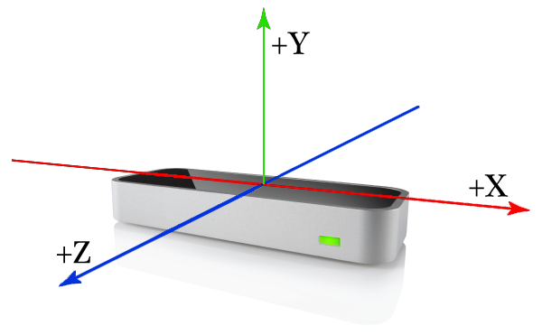
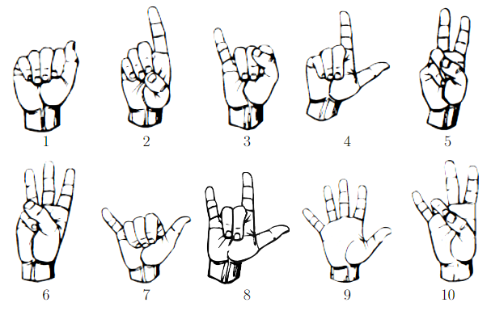
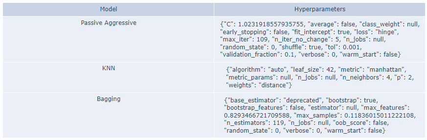
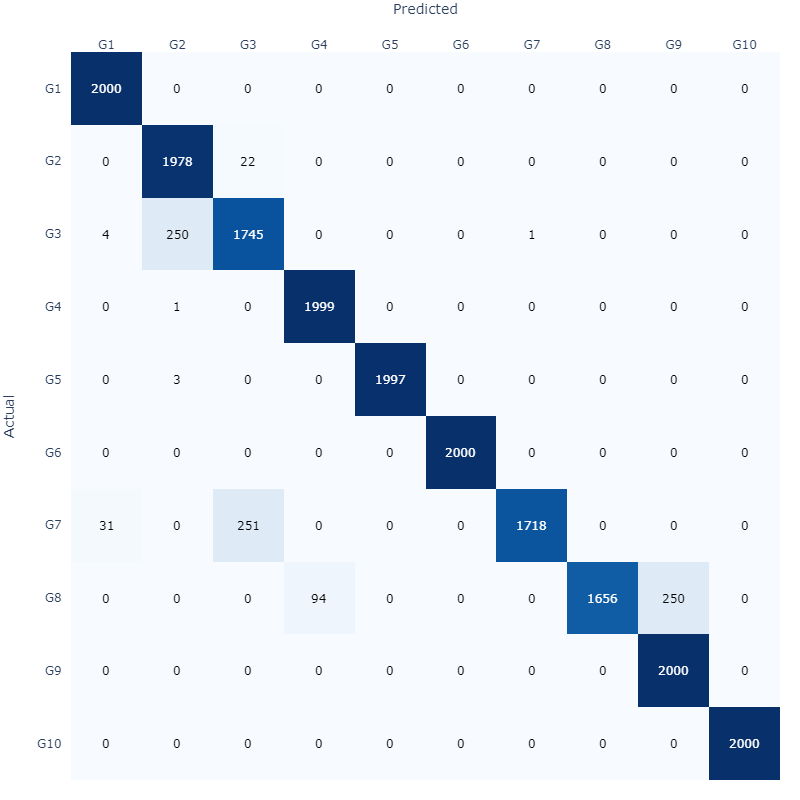

# Leap Motion Gesture Recognition

This repository contains the code of the experiments and the dataset created for the researched solution to minimize the risks of contamination through the recognition of hand gestures. It includes a defined gesture vocabulary, a dataset consisting of 9 distinct gestures, and 20,000 samples and experiments with various classifiers. The achieved accuracy of 95.8% demonstrates the potential of this approach. Improve hygiene and efficiency in hospital environments with this innovative touchless control system.

## Table of Contents

- [Project Overview](#project-overview)
- [Installation](#installation)
- [Usage](#usage)
- [Dataset](#dataset)
- [Methodology](#methodology)
- [Results](#results)
- [Contributing](#contributing)
- [License](#license)

## Project Overview

This repository contains experiments on the use of machine learning for gesture recognition using the Leap Motion sensor, ilustred in the figure. 

## Dataset

The dataset comprises 250 frames per person, collected from 9 individuals, with 10 distinct gestures, resulting in a total of 22,500 samples. The same gesture vocabulary as [Marin 2014](https://doi.org/10.1109/icip.2014.7025313) was employed, as shown in figure.

## Usage

Install the required dependencies from [requirements](./requirements.txt) and run the code in Jupyter Notebook. Alternatively, you can easily open the notebook directly in Google Colab for seamless execution.

## Methodology

We conducted experiments using various classifiers, including:

  * Ridge
  * Logistic Regression
  * SGD
  * Perceptron
  * Passive Aggressive
  * SVM
  * KNN
  * Decision Tree
  * Multi Layer Perceptron
  * Random Forest
  * Gradient Boosting
  * Extra Trees
  * Bagging
  * LGBM
  * XGB
  
The classifiers were evaluated and optimized using Bayesian search for hyperparameter tuning. Based on the results, the best models were selected, and combinations of these models were explored. 

## Results

The best combinations of models reached 95.8% accuracy. The figures illustrates the best combination along with their corresponding hyperparameters, and the confusion matrix of the model validation.

